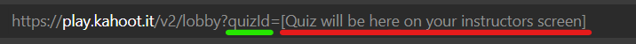
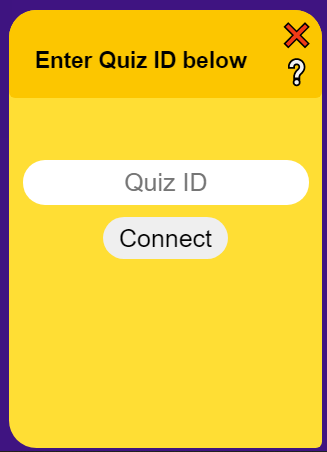
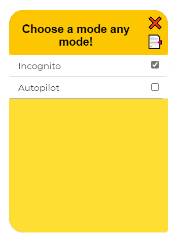
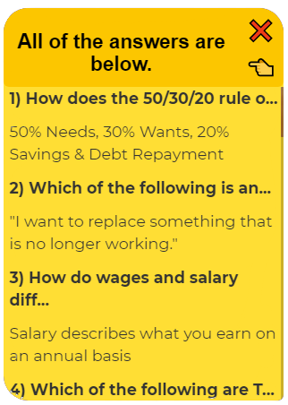
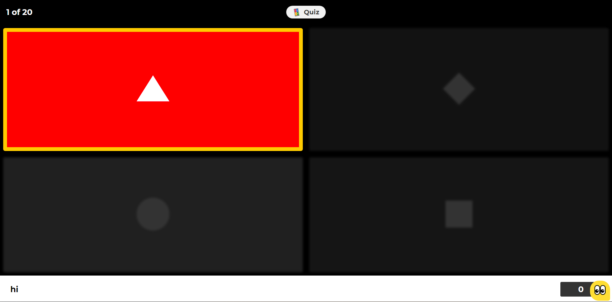
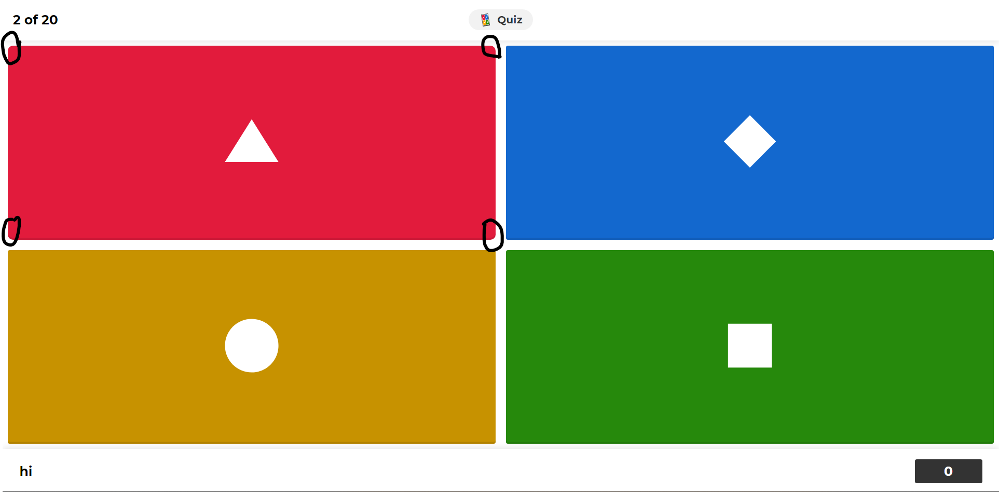

# Kaheet

[](https://github.com/EShrestha/kaheet/stargazers)

[](https://github.com/EShrestha/kaheet/issues)

[](https://github.com/EShrestha/kaheet)

## Overview

Kaheet is a free kahoot cheat originally by [pxtrez](https://github.com/pxtrez)
Implemented GUI and modes by [Airdik](https://github.com/Airdik) and [Ratel](https://github.com/Ratel8989)

- [How to use](#how-to-use)
    * [Cheat](#Cheat)
- [Any bugs or problems?](#any-bugs-or-problems)

## How to use?

To use the cheat, simply copy [script](#Cheat) then paste it into the browsers console once you are in the game.

### Cheat

1. Join Kahoot Game
2. Open browser console <kbd>F12</kbd> and paste the script from below:

```ts
fetch("https://raw.githubusercontent.com/EShrestha/kaheet/main/src/Run.js")
.then((a) => a.text()
.then((b) => eval(b)
.then((c) => eval(c))))
```
3. A GUI bubble will appear at the bottom right of your screen.


4. It will only be visible for the first click as Incognito mode is on by default, once closed you can open again by either clicking the invisible space at the bottom right of your screen or by pressing <kbd>Ctrl</kbd> + <kbd>Shift</kbd>, which will also close/open the GUI when it is opened/closed.

5. Then enter the quiz ID, it will be on the URL of your instructors screen.





6. If the quiz ID is valid and the game is not private you will see the Modes page. Some modes have extra options, which you can access by clicking their names.



7. You can also view all of the correct answers by clicking 📑




8. Once you are playing
    - The correct answer(s) will be clearly highlighted. Incorrect answer(s) will be dimmed.

    

    - In Incognito mode the correct answer(s) box corner will be slightly rounder then the rest  
        * When you hover over the correct answer(s) your cursor symbol should be loading. 
        * In Incognito mode when you hover over wrong answers your cursor symbol will be a not-allowed symbol. 


## Unit Test

- Having problems?
    * You can paste the script below into you browser console. NOTE: it will only work when you are on the kahoot.it site.

```ts
fetch("https://raw.githubusercontent.com/EShrestha/kaheet/main/Test/testRunner.js")
.then((a) => a.text()
.then((b) => eval(b)
.then((c) => eval(c))))
```
- Kaheet should be working fine if all tests pass.
    * Ignore the red errors chrome throws, as long as all of the tests are green you're good. 
- If a test fails
    * Please submitted an issue at [Bugs or Problems](#any-bugs-or-problems) detailing what occurred.

## Bugs

Known bugs and temporary workarounds.

1. When the teacher chooses: random answers and/or random questions, the kaheet is in trouble. Highlights wrong answers and themes do not work properly. 
    * Then you should just find the correct answer by clicking 📑 in the modes page.

2. Cheat doesn't work for private quizzes
    * No workaround at the moment, good luck!

## Any bugs or problems?

Please create an issue detailing what bugs or problems you encountered.
